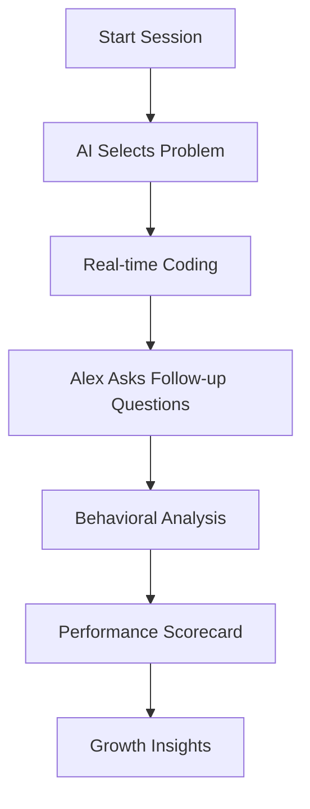
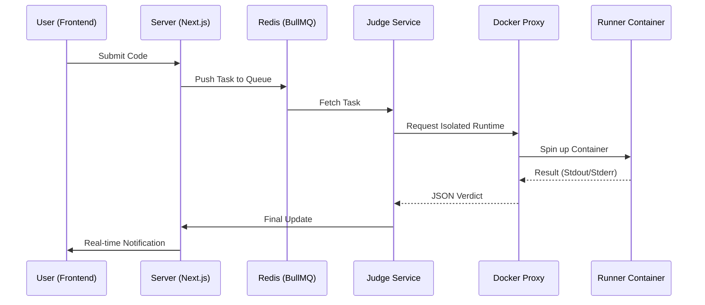
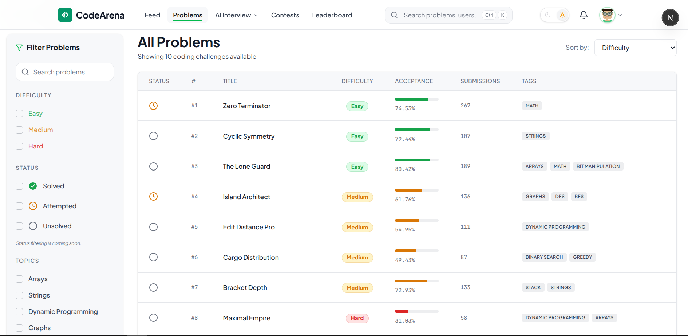
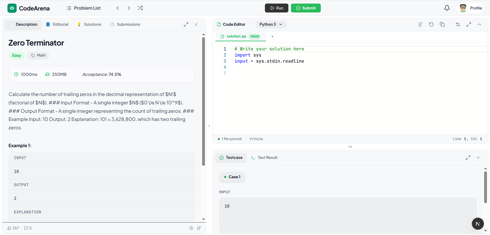
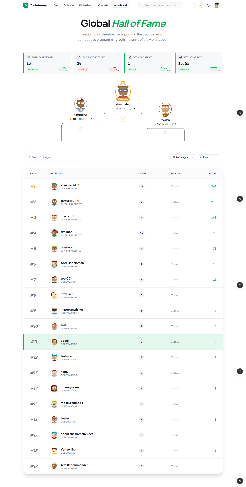

<div align="center">

<br/>

```
     ██████╗   ██████╗  ██████╗  ███████╗  █████╗  ██████╗  ███████╗ ███╗   ██╗  █████╗ 
  ██╔════╝   ██╔═══██╗  ██╔══██╗ ██╔════╝  ██╔══██╗ ██╔══██╗ ██╔════╝ ████╗  ██║ ██╔══██╗
  ██║        ██║   ██║  ██║  ██║ █████╗    ███████║ ██████╔╝ █████╗   ██╔██╗ ██║ ███████║
  ██║        ██║   ██║  ██║  ██║ ██╔══╝    ██╔══██║ ██╔══██╗ ██╔══╝   ██║╚██╗██║ ██╔══██║
    ╚██████╗ ╚██████╔  ╝██████╔ ╝███████  ╗██║  ██║ ██║  ██ ║███████ ╗██║ ╚████ ║██║  ██║
     ╚═════╝  ╚═════╝   ╚═════╝  ╚══════╝  ╚═╝  ╚═╝ ╚═╝  ╚═╝ ╚══════╝ ╚═╝  ╚═══╝ ╚═╝  ╚═╝
```

**A full-stack online judge & competitive programming platform**

---

# 🌌 CodeArena
### **Elevate Your Engineering Soul**

**The Ultimate Production-Grade Competitive Programming & AI Coaching Ecosystem**

---

[](https://nextjs.org/)
[](https://react.dev/)
[](https://tailwindcss.com/)
[](#-ai-career-coach-alex)
[](https://www.docker.com/)

---

[**Explore Features**](#-key-capabilities) • [**Technical Specs**](#-tech-stack) • [**Quick Start**](#-getting-started) • [**API Docs**](#-api-registry)

---

</div>

## 📑 Table of Contents
- [✨ Key Capabilities](#-key-capabilities)
- [🤖 AI Career Coach (Alex)](#-ai-career-coach-alex)
- [⚙️ The Judge Engine](#-the-judge-engine)
- [🛠️ Tech Stack](#-tech-stack)
- [🌍 Supported Ecosystem](#-supported-ecosystem)
- [🚀 Getting Started](#-getting-started)
- [👥 The Team](#-the-team)

---

## ✨ Key Capabilities

<div align="center">
<table>
  <tr>
    <td width="33%" valign="top">
      <h3>🛡️ Secure Judge</h3>
      <p>Isolated Docker-based execution pipeline supporting 5+ languages with sub-millisecond accuracy.</p>
    </td>
    <td width="33%" valign="top">
      <h3>🤖 AI Alex</h3>
      <p>Next-gen career coach that simulates real FAANG interviews and evaluates architectural logic.</p>
    </td>
    <td width="33%" valign="top">
      <h3>⚔️ Live Arena</h3>
      <p>Real-time competitive environment with low-latency leaderboards via Socket.io.</p>
    </td>
  </tr>
  <tr>
    <td width="33%" valign="top">
      <h3>📱 Dev Feed</h3>
      <p>Unified developer social stream for sharing solutions, tips, and platform updates.</p>
    </td>
    <td width="33%" valign="top">
      <h3>📊 Performance</h3>
      <p>Deep analytics including heatmap activity, language proficiency, and weakness detection.</p>
    </td>
    <td width="33%" valign="top">
      <h3>⚙️ Admin Ops</h3>
      <p>Powerful dashboard for system monitoring, problem design, and user management.</p>
    </td>
  </tr>
</table>
</div>

---

## 🤖 AI Career Coach (Alex)

Alex is not just a chatbot—he is a Senior Staff Engineer simulating the pressure of high-stakes technical interviews. 



**What Alex evaluates:**
- **Algorithmic Complexity**: O(n) vs O(n log n) tradeoffs.
- **Clean Code**: SOLID principles and production-ready structure.
- **Communication**: Your ability to explain logic under pressure.

---

## ⚙️ The Judge Engine

Our execution environment is built for scale and security, utilizing a multi-layered proxy system to protect the host machine.



---

## 🛠️ Tech Stack

### **Modern Core**
- **Framework**: [Next.js 16](https://nextjs.org/) (App Router, Server Components)
- **UI Architecture**: [React 19](https://react.dev/) + [Zustand](https://github.com/pmndrs/zustand)
- **Styling**: [Tailwind CSS v4](https://tailwindcss.com/) + [Framer Motion](https://www.framer.com/motion/)

### **High-Performance Infrastructure**
- **Runtime**: [Node.js](https://nodejs.org/) + [Socket.io](https://socket.io/)
- **Data Layers**: [MongoDB](https://www.mongodb.com/) + [Redis](https://redis.io/)
- **Job Processing**: [BullMQ](https://docs.bullmq.io/)
- **Intelligence**: [Google Generative AI](https://ai.google.dev/) (Alex AI)

---

## 🌍 Supported Ecosystem

### **Languages**
| 🚀 C++ | 🐍 Python | ☕ Java | 📦 JS | 🐹 Go |
| :---: | :---: | :---: | :---: | :---: |
| ✅ | ✅ | ✅ | ✅ | ✅ |

### **Judge Verdicts**
> `ACCEPTED` • `WRONG_ANSWER` • `TLE` • `MLE` • `RUNTIME_ERROR` • `JUDGING`

---

## 🖼️ Visual Gallery

<div align="center">
<table>
  <tr>
    <td align="center"><br/><sub><b>Cyber Hero Landing</b></sub></td>
    <td align="center"><br/><sub><b>Problem Ecosystem</b></sub></td>
  </tr>
  <tr>
    <td align="center"><br/><sub><b>Monaco Workspace</b></sub></td>
    <td align="center"><br/><sub><b>Global Rankings</b></sub></td>
  </tr>
</table>
</div>

---

## 🚀 Getting Started

### **The 1-Minute Setup**
The fastest way to get CodeArena running is using our automated setup script:

```bash
# Clone and setup
git clone https://github.com/rabiulislam5334/CodeArena-TeamProject.git
cd codearena
chmod +x setup.sh
./setup.sh
```

### **Manual Configuration**
1. **Dependencies**: `npm install`
2. **Environment**: Sync `.env.local` (Requires MongoDB, Redis, and Firebase keys).
3. **Execute Engine**: `npm run docker:build`
4. **Dev Start**: `npm run dev`

---

## 👥 The Team

<div align="center">

| Role | Talent |
|---|---|
| 👑 **Lead** | Rabiul Islam |
| 🛡️ **Architect / Engine / Backend** | Arafat Salehin |
| ⚡ **Core Systems** | AH Muzahid |
| 🎨 **Architect /UI / UX Master** | Shahnawas Adeel |
| ✨ **Creative Frontend** | Abdullah Noman |
| 🚀 **Content** | Ummey Salma Tamanna |

</div>

---

<div align="center">

**Built for the next generation of engineers.**
Join the revolution.

[⭐ Star on GitHub](https://github.com/rabiulislam5334/CodeArena-TeamProject) 

</div>
